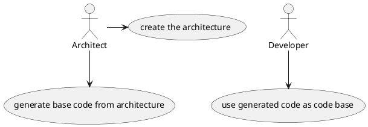

# codegen
Project to generate code in different langages

## Introduction

The original goal of this project is to allow developers to easily generate code from architecture design documents.

The generated code could then serve as a base for further development.

The main use case is the following:



## Architecture overview

The project is based around 3 major components:

- An input parser
- A translator
- A templated file generator

The goal is to make this project extensible to be able to support a multitude of input and output langages.

## Test

For now you can use the following command for testing

```bash
python3 ./codegen.py -i PLANTUML -o CPP -p test_dir/test.plantuml -d test_dir
python3 ./codegen.py -i PLANTUML -o CPP -p test_dir/plantuml/diagrams -d test_dir/plantuml/generated_code/
```
