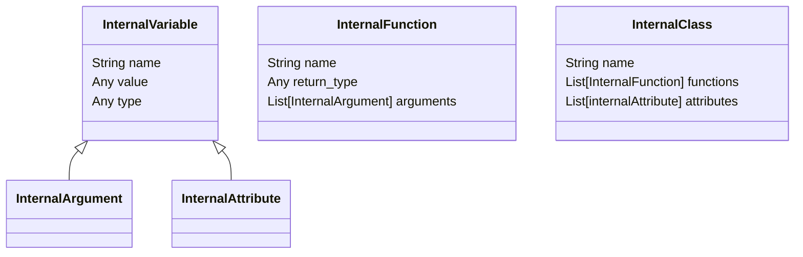
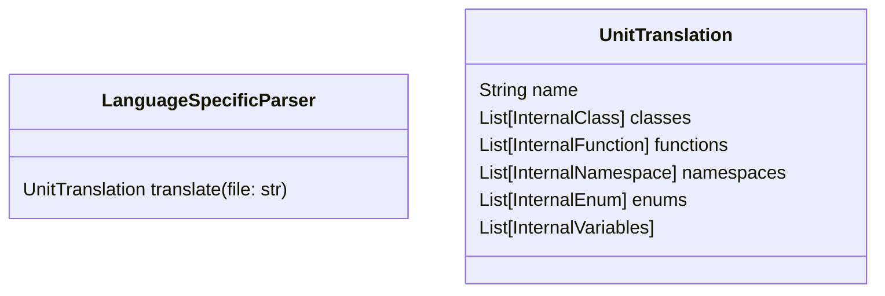
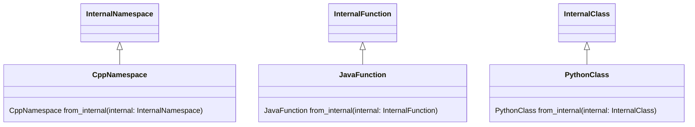

# Codegen

Project to generate code in different languages

## Introduction

The original goal of this project is to allow developers to easily generate code from architecture design documents.

The generated code could then serve as a base for further development.

The original use case is the following:

> An `architect` ***creates an interface*** and documents it using a class diagram (using plantuml for example).
> The `architect` ***generate the code*** for the class interface using the tool
> Based on the generated code, the `developer` can ***implement the desired behavior*** of the class

## How to use the tool ?

Codegen is a command line tool for now.

It is expected to be launched in a terminal using python and with a certain number of arguments.

### Single file usage

A basic usage of the tool would be to generate code from a single input file :

```bash
python codegen.py --input PLANTUML --output CPP --path test_dir/test.plantuml --dest test_dir
```

This usage will generate a c++ header file from the test.plantuml class diagram.
The generated header will be placed in the test_dir directory.

### Directory usage

Codegen can also be used to generate code from all the files in a directory.
In that case the tool will also consider files that are in subdirectories.
The internal structure of the input directory will be reproduced in the output directory.

To do so, you just need to provide a directory as input path:

```bash
python codegen.py -i PLANTUML -o CPP -p test_dir/plantuml/diagrams -d test_dir/plantuml/generated_code/
```

### Usage notes

#### The lock feature

Codegen has a lock feature that will prevent you to regenerate some code unless you really want it.

This is achieved by adding a small footer at the end of the generated code.

Before overwriting a file, the tool check for the presence of this footer:

- If the footer is absent, the file is overwriten
- If the footer is present, a warning message is displayed to inform you that the generation was not done.

Note that you can force the generation by passing the `-f` or `--force` argument to the command line

#### Configuration customization (Experimental)

To customize the behavior of the Codegen tool, you can provide specific configuration file.
the path to this configuration is given by passing the `-c` or `--config` argument to the command line

## How the tool works ?

### Architecture overview

The project is based around 3 major components:

- An internal language
- An input parser (support for input language)
- A output file generator (support for output language)

Those 3 components interact as follow:

- The input parser translate a file using an input language into the internal language
- The output file generator translates the internal language into the targeted output language based on a given template.

The goal is to make this project extensible to be able to support a multitude of input and output languages.

### The internal language

The goal of the internal language is to provide a collection of elements that are present in programming language.
Some example could be:

- variables
- functions
- types
- classes
- namespaces
- ...

The idea is to have in the internal language a lot (if not all) of the programming basic tools used by other languages.

Regarding the current implementation, those basic tools are store as objects.

See bellow an architectural insight:



> Disclaimer: The goal of this diagram is to explain the concept. The actual implementation can have added specificities

### The input parser

The input parser's role is to identify programming basic tools (variables, function, etc) in the input file considering its language.
This will allow to convert language specific syntax into internal language object and retain their useful information.
This is an object that will take text as an input and return a set of internal objects. This set is called a unit translation and represent the parsed file in internal language.

See bellow an architectural insight:



> Disclaimer: The goal of this diagram is to explain the concept. The actual implementation can have added specificities

### The output file generator

The output file generator's role is to take the content of a unit translation and represent it using the targeted language syntax.
This module will be responsible of the refinement of the internal objects information to fit the targeted language.
An example could be convert plantuml namespace representation to c++ representation: `my.namespace.representation` would become `my::namespace::representation`
This will be achieved by developing language specific versions of the internal object.
Those language specific versions will be represented using template files.

See bellow an architectural insight:



> Disclaimer: The goal of this diagram is to explain the concept. The actual implementation can have added specificities

## How to contribute

To make the tool usable by more people, you could add parser or generator for your favorite language.

This will help the tool to support more and more translation possibilities.

The idea would be to add missing object in the internal language depending on the needs of every languages.

And don't hesitate to propose optimizations in the generator / generated code :)

A more detailed tutorial on how to add support to a new language will be added to this page later.
