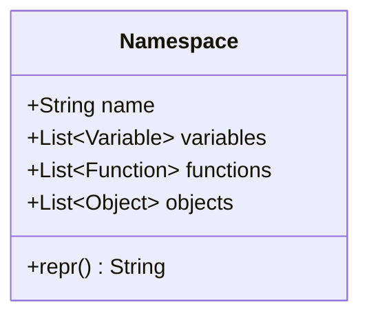

# Intermediate language namespaces

The namespaces should be considered as follow:

```mermaid
classDiagram
    class Namespace {
        +String name
        +List~Variable~ variables
        +List~Function~ functions
        +List~Object~ objects
        +repr() String
    }
```
