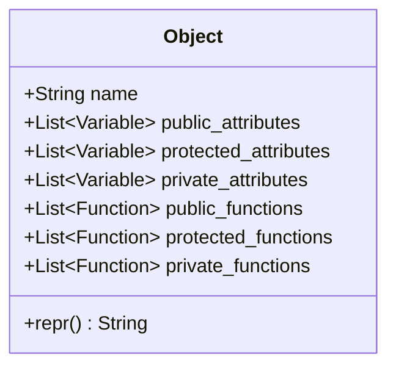

# Intermediate language objects

The objects should be considered as follow:

```mermaid
classDiagram
    class Object {
        +String name
        +List~Variable~ public_attributes
        +List~Variable~ protected_attributes
        +List~Variable~ private_attributes
        +List~Function~ public_functions
        +List~Function~ protected_functions
        +List~Function~ private_functions
        +repr() String
    }
```
