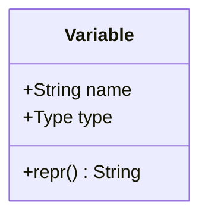

# Intermediate language variables

The variables should be considered as follow:

```mermaid
classDiagram
    class Variable {
        +String name
        +Type type
        +repr() String
    }
```
