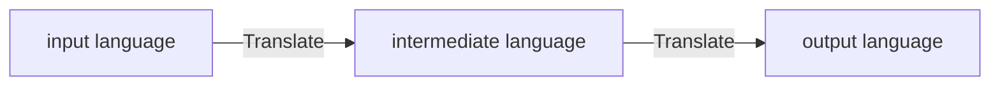

# Codegen concept

## The idea

The idea behind codegen is that the development you are trying to do is more about the logic than
the programming language that you are using.

With that in mind, I wanted to treat programming languages like spoken languages and allow
translations between languages.

The idea is to keep the logic while changing the form.

To do so, the solution I want to use is to have an intermediate language. This language will be the
key of the growth of the codegen tool, allowing to add input and output languages simply by
specifying how they translate into the intermediate language.

The idea is then as follow:

